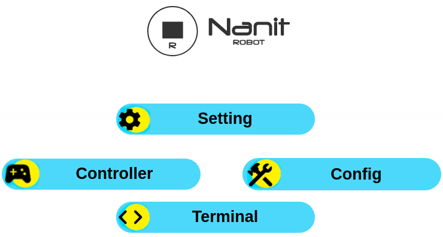

Firmware for WiFi 8266 Witty Cloud
==================================

On this page, you can download the firmware for the WiFi 8266 Witty Cloud module, designed to work with our custom-built interface.

Interface Features:

* 🚙 Ground drone control

* 🏠 Smart home integration

* 💻 Terminal access and additional tools

Advantages of the NANIT platform:

🔹 Reliable and stable operation

🔹 Easy to use

🔹 Wide possibilities for future expansion
